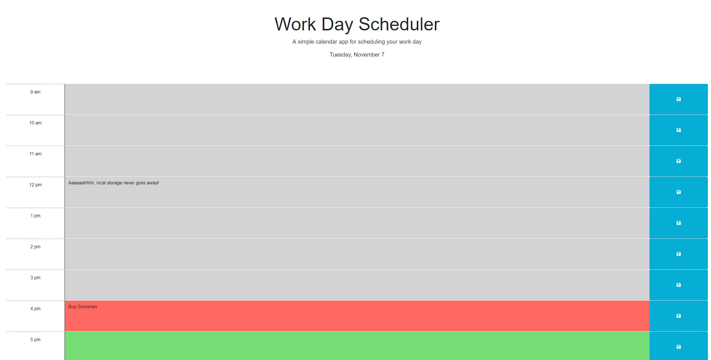

# work-schedule

Behold!  A scheduler for your 9-5 job!

Time slots in the past are marked in grey.  Time slots corresponding to the current hour are marked in red.  Future time slots are marked in green.

In order to use the webapp, just click on the text box and begin typing!  When you're finished, click on the blue save button to the right.  Now it
will show up every time you load the page, just to remind you how much you do the same things over and over!  And if you're like me and you forgot to 
add something, but want it to show up for tomorrow, don't worry!  You can still add things to past time slots, and they'll save just like the other
slots will.

This webapp uses jQuery in conjunction with local storage to give you a schedule app.  Enjoy!